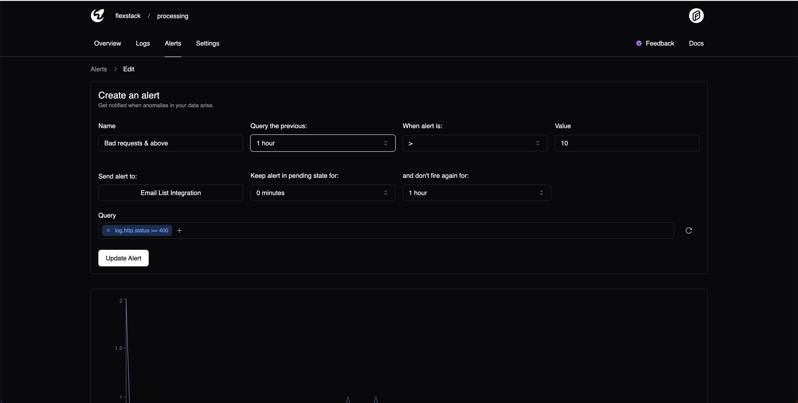

# Alerts

Moonbase allows you write [MQL](./mql) to alert on your data.

Alerts are analyzed as logs are ingested, so you get alerted in real-time.

Currently, Moonbase supports the following integrations:

1. Email
2. Slack

You can add more integrations under your team settings page.

