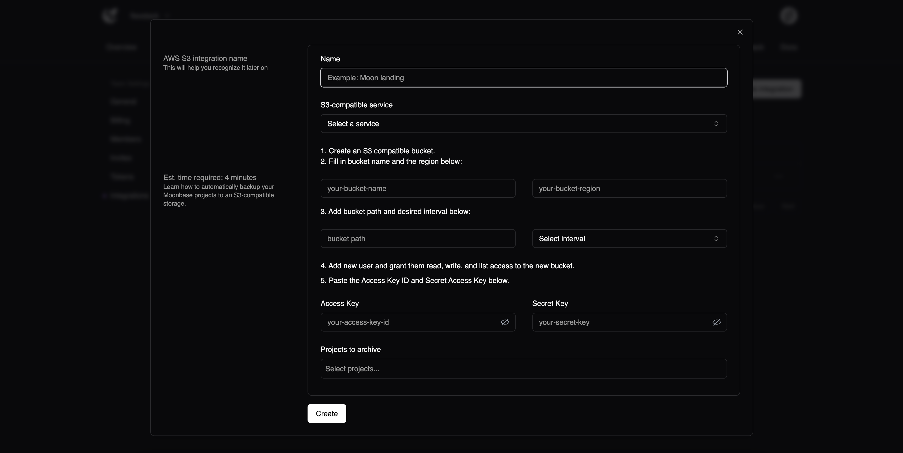

# Integrations

Integrations provide extra flavors of functionality on top of core Moonbase features. You can configure integrations at the team level from within the Team Settings page.

## Email

Email integration allows you to set up any number of email lists. Email lists are useful for alerting.

## Slack

Slack intgration allows you to link your Slack channel to Moonbase. Useful if you want to send alerts to a specific channel. You can link any number of Slack channels from a single org.

If you wish to link different org Slack channels, you will need to create a new team.

## S3

S3 integration allows you to offload your data to any S3-compliant service. Some examples include:
1. DigitalOcean Spaces
2. Amazon S3
3. Ceph Object Gateway

You can set an interval for how often Moonbase will offload your data. The current interval options are `daily`, `weekly` and `monthly`.

Example: If you choose to offload to S3 daily, Moonbase will ship your logs in CSV format to your bucket of choice.