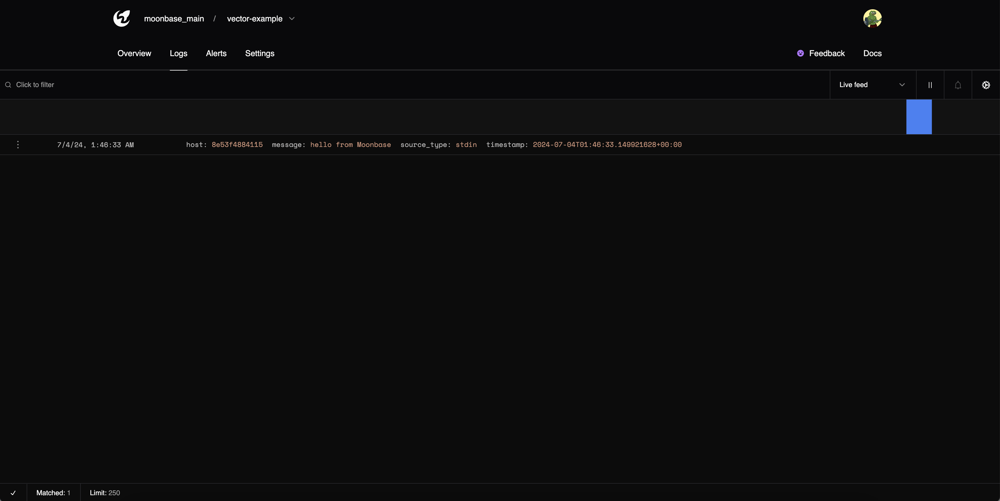

## Vector

[Vector](https://vector.dev/) is a simple, lightweight agent for collecting, transforming, and routing all your logs and metrics.

There are various ways to tailor your vector config to your application, but for these examples, we'll be keeping it simple.

### Docker

Create your vector file. In this example, we'll capture input from stdin and ship them to Moonbase.

#### Create your Vector file

```bash copy
cat <<-EOF > $PWD/vector.yaml
sources:
  example_source:
    type: stdin # You can change this to your log source type

transforms:
  add_fields:
    type: remap
    inputs:
      - example_source
    source: |
      .timestamp = format_timestamp!(now(), "%+")

sinks:
  moonbase:
    type: http
    inputs:
      - add_fields
    uri: "https://api.moonbasehq.com/v1/projects/<projectd>/logs"
    encoding:
      codec: json
    batch:
      max_events: 100
      timeout_secs: 5
    request:
      compression: gzip # Optional, if you want to compress the logs
      retry_attempts: 10
      retry_backoff_secs: 5
      headers:
        x-moonbase-token: "<token>"
EOF
```

Make sure to replace `<projectid>` and `<token>` with your information.


#### Run Vector

```bash copy
echo 'hello from Moonbase' | docker run -i -v $(pwd)/vector.yaml:/etc/vector/vector.yaml --rm timberio/vector:0.39.0-debian
```

#### Voilà

Naviage to your project page and see your logs

