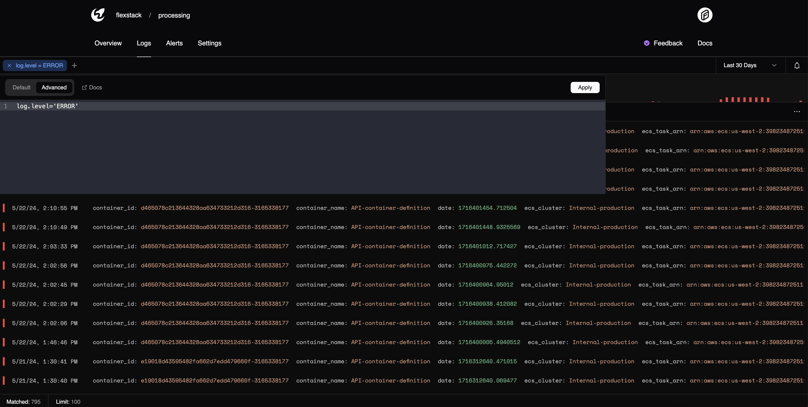

# Logs

Moonbase provides an optimized logging platform that utilizes ClickHouse and other various technologies under the hood.

Moonbase ensures that you're able to query logs as fast as possible.


## Log Attributes

Query Attributes are similar to Datadog 'tags'. These are useful to filter on arbitrary log data.

An example log with a single attribute could look like:

```json
{
    "body": "This is a service log",
    "level": "info",
    "attributes": {
        "service_ip": "65.188.218.18"
    }
}
```

As query Attributes are ingested, Moonbase gathers them and displays them for query building.

Querying an attribute is as simple as:

```sql
attributes['service_ip'] = "65.188.218.18"
```

## Log Levels

Out of the box, Moonbase recognizes the following log levels:

1. fatal
2. error
3. warn
4. info
5. debug
6. trace

Moonbase dashboard does its best to display these accordingly. For now, If any log levels aren't recognized, the API rejects the value.


## Querying

There are currently 3 different ways to query logs from the dashboard:

1. Basic queries
2. Query builder
3. Advanced (MQL)



Advanced querying allows you to submit MQL queries to the API to be interpreted similiarly to a SQL 'filter'.


