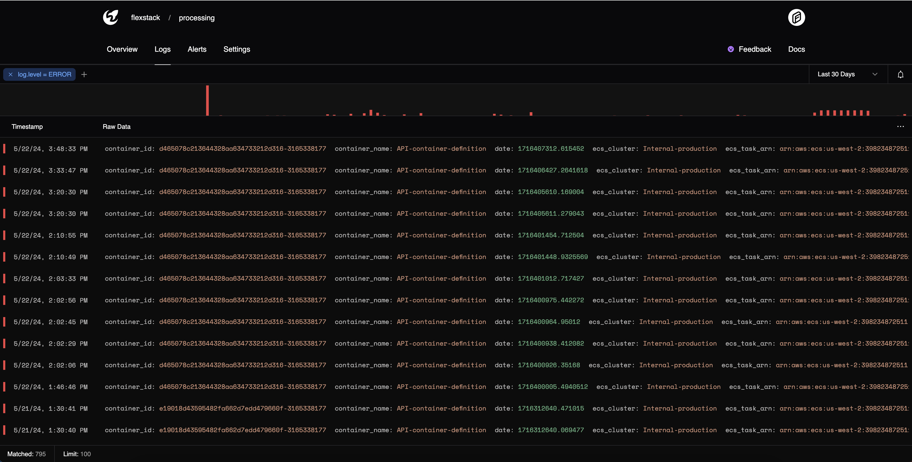
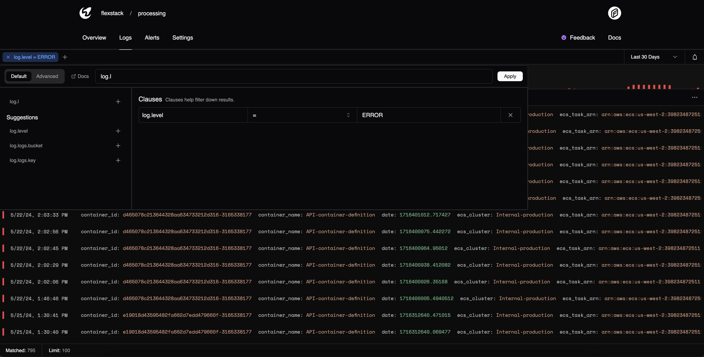

# Logs

Moonbase provides an optimized logging platform that utilizes ClickHouse and other various technologies under the hood.

Moonbase attempts to index fields as fast as possible so that you're able to query logs near instantly.


## Log Schema

Logs are crawled and analyzed at ingestion time. Moonbase indexes every field in the payload so that you can query nested values efficiently.

An example log could look like:

```json
{
  "date": 1714005647.6969,
  "meta": {
    "time": "2024-04-28T17:35:37.9848259Z",
    "level": "info",
    "msg": "GET /v1/environments/1C9y47b5rLS32mcVsG9V5W/components",
    "service": "http",
    "http": {
      "status": 200,
      "duration": 4778294,
      "size": 30,
      "ip": "68.8.141.151",
      "something": "inhere",
      "abuse": true
    }
  }
}
```

Querying an field is as simple as:

```sql
meta.http.status > 200
```

## Log Levels

Out of the box, Moonbase recognizes the following log levels:

1. fatal
2. error
3. warn
4. info
5. debug
6. trace

Moonbase dashboard does its best to display these accordingly. For now, If any log levels aren't recognized, the API rejects the value.



## Querying

There are currently 2 different ways to query logs from the dashboard:

1. Query Builder (for basic queries)
3. Advanced (MQL)


Advanced querying allows you to submit MQL queries to the API to be interpreted similiarly to a SQL 'filter'.



As you type a field in the builder, Moonbase gives you a set of recommended indexed fields to query on.

You still have the option to query any arbitrary fields if Moonbase does not immediately recognize the field you type. 
