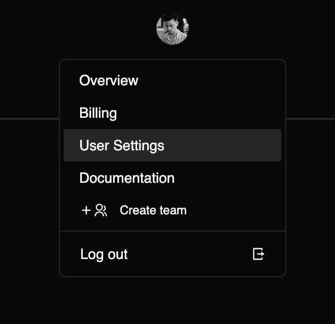

# Personal Accounts

If you're a solo builder, a personal account is likely sufficient for you.

You can manage all of your user settings similiarly to team settings, including: billing, tokens, integrations, etc.

For a more collaborative experience, we recommend managing teams.
