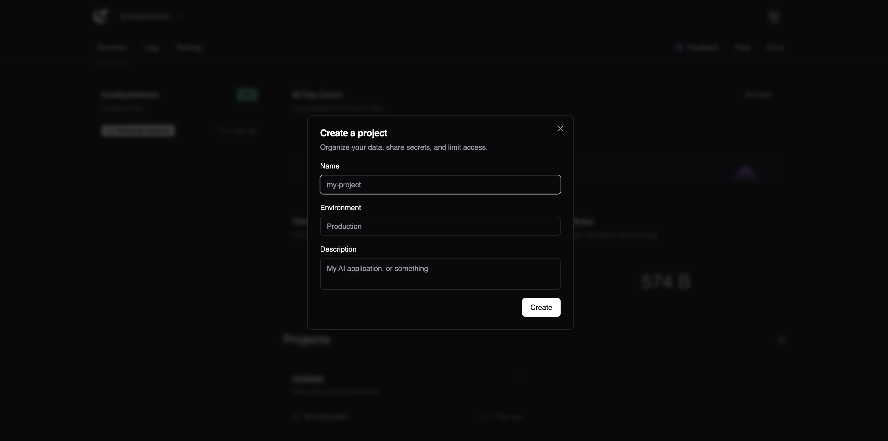
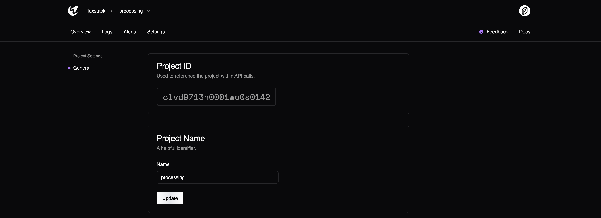
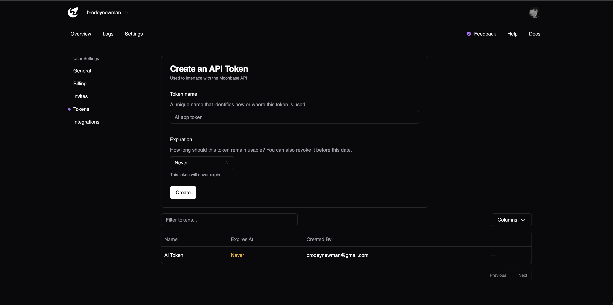

# Quickstart

Learn how to quickly set up Moonbase.

## Prerequisites

It's recommended that you follow the onboarding process after signing up.

#### 1. Create a project



Your project ID can be found on the projects page.



#### 2. Create an API key



You can create an API key under your team settings. This is available for both personal accounts and team accounts.

#### 3. Send logs

```bash
curl -X POST "https://api.moonbasehq.com/v1/logs" \
  -H "x-moonbase-token: <token>" \
  -H "Content-Type: application/json" \
  -d '{
    "data": [
      {
        "body": "Congrats! You published your first log.",
        "level": "info",
        "attributes": {
          "onboarding": "true"
        }
      }
    ],
    "projectId": "<projectId>"
  }'
```

## SDK Installation

Install the SDK. For this example, we'll be using the Node SDK.

```bash
pnpm i --save @moonbasehq/js-core
```

Configure the SDK

```js
const moon = new Moonbase({
  apiKey: "moonbase_72UyVRAPaKRhkbt1uEoa34NKhf2EsiXQqeEOjln36JU=",
});
```

Ingest logs for a project

```js
import { Moonbase } from "@moonbasehq/js";
import { faker } from "@faker-js/faker";

const messages = [
  {
    body: "This is your log",
    level: "info",
    attributes: {
      some: "service"
    }
  }
]

moon.ingest("clqq3cle50009zg3fplnzqwxs", messages).then((res) => {
  console.log('Done ingesting!');
}).
```
