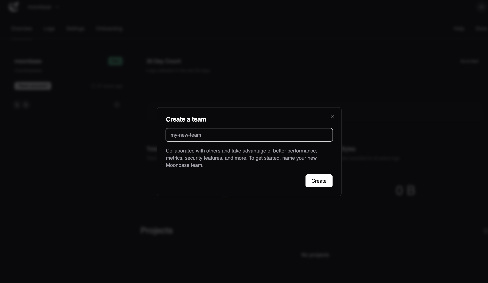
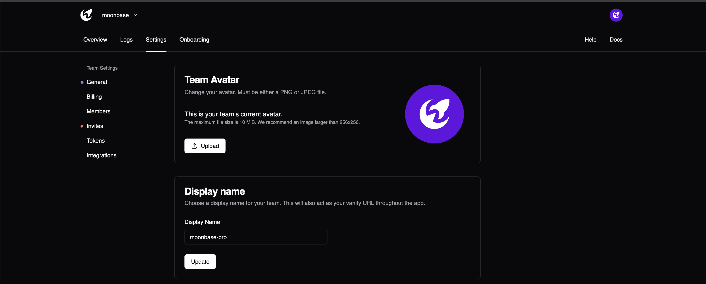

# Managing Teams

Collaborating with your team is important. By default, a Personal Account is created on your behalf when you sign up.

To work in a more *collaborative* environment, we recommend creating a new team and inviting your mates.

Teams have a separate settings page for managing billing, inviting teammates, creating integrations, etc.

Under the hood, Personal accounts and Teams operate similiarly; the only real difference is the ability to collaborate.
If your operation is beyond a single party, we recommend operating out of a team account.

